# Book Nook

Book Nook is a cozy and welcoming space for bibliophiles to share their reviews on books they've read with fellow book lovers.
It captures the idea of a community where readers can find refuge and camaraderie through their shared love of literature.

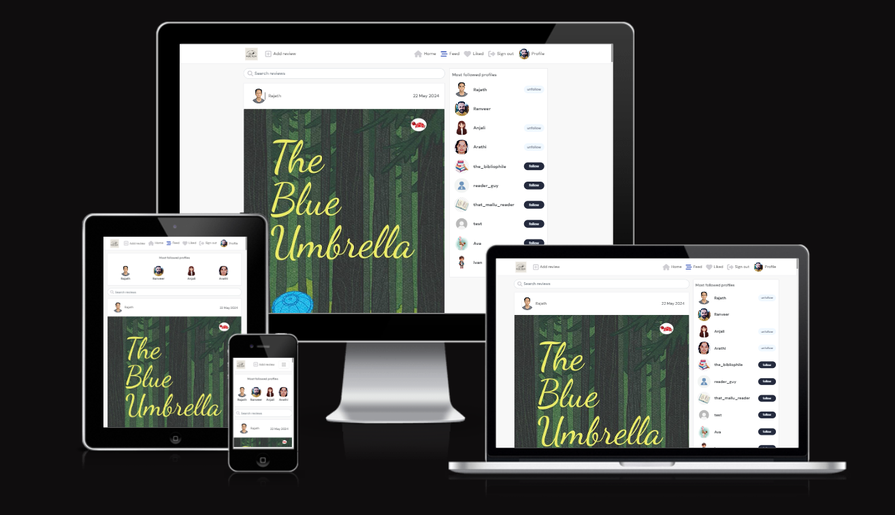     

[Live Website](https://book-nook-react-acffc4887a25.herokuapp.com/)    

[Back-end API](https://book-nook-api-899ce4385a72.herokuapp.com/)    

# Table of contents
- [Book Nook](#book-nook)
- [Table of contents](#table-of-contents)
- [UX](#ux)
    - [Site Purpose](#site-purpose)
    - [Site Goal](#site-goal)
    - [Audience](#audience)
    - [User Goal](#user-goal)
- [Design](#design)
    - [Wireframes](#wireframes)
    - [Colour Palette](#colour-palette)
    - [Typography](#typography)
    - [Images](#images)
- [Agile Methodologies](#agile-methodologies)
    - [MoSCoW Prioritization](#moscow-prioritization)
    - [User Stories](#user-stories)
- [Features](#features)
    - [Navigation Bar](#navigation-bar)
    - [Home Page](#home-page)
    - [Profile](#profile)
    - [Review](#review)
    - [Popular Profiles](#popular-profiles)
    - [Comments, Likes \& Followers](#comments-likes-followers)
    - [Search](#search)
    - [Future Features:](#future-features)
    - [Reusable Components:](#reusable-components)
- [Testing](#testing)
    - [Validator Testing](#validator-testing)
    - [Manual Testing](#manual-testing)
    - [Automation Testing](#automation-testing)
    - [Unfixed Bugs](#unfixed-bugs)
- [Packages and Tools used](#packages-and-tools-used)
- [Deployment \& Usage](#deployment--usage)
    - [Deployment](#deployment)
    - [How to Fork](#how-to-fork)
    - [How to Clone](#how-to-clone)
- [Credits](#credits)
    - [Media](#media)
    - [Content](#content)

# UX
### Site Purpose
To provide a platoform for bibliophiles to interact and share their thoughts on their favourite books. It is like a community of readers.

### Site Goal
To provide readers an opportunity to share their reviews, read reviews written by fellow readers, and interact with the community through likes, comments and followers. 

### Audience
Anybody that wants to read and has an interest in books.

### User Goal
Be part of a reader community.

# Design
### Wireframes
I created the wireframes using Balsamiq desktop tool before starting coding. There are some changes between the wireframe designs and the actual implemented designs due to more clarity during the project implemention.

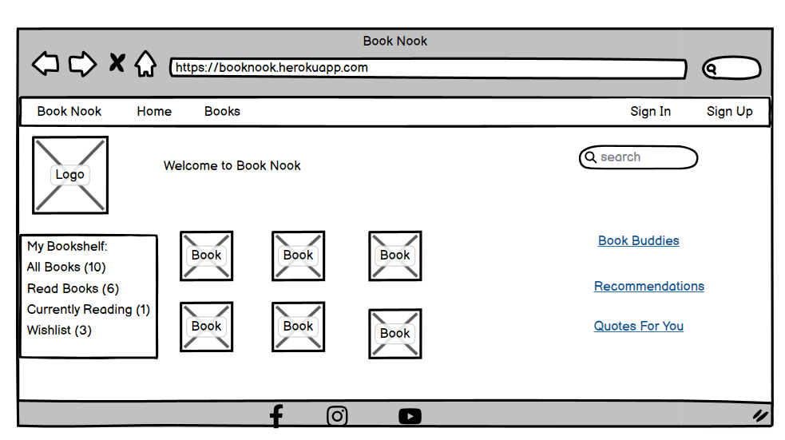     

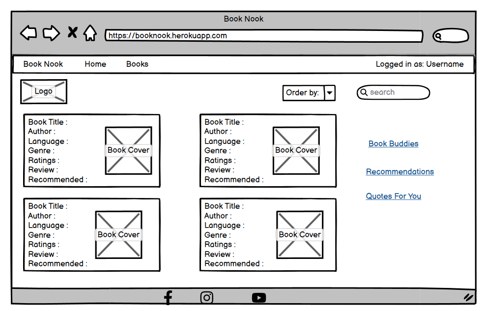     

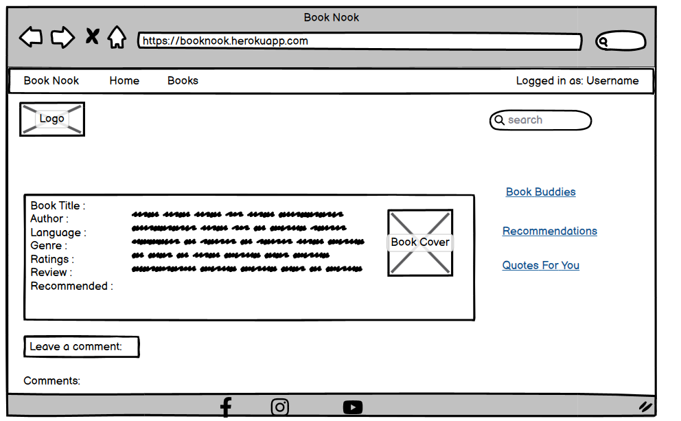     

### Colour Palette     

I have used shades of brown to give the user a feel of wooden bookshelves in a library. Also I have used shades of white to give the user a visual contrast.    

### Typography    

Google Fonts is used for the fonts displayed on the website. I have selected simple fonts to ensure a smooth and comfortable reading experience for the users.    

### Images    

All the images are downloaded from the internet and belongs to the respective owners. I have used images that are publicly available on websites like Wikipedia. I hereby give due credit to the respective owners of all the images.   

# Agile Methodologies    

Book Nook is my second project where I followed Agile planning methods by myself. I had done it for my portfolio project 4 and also participated in Code Institute's March Hackathon. These experiences helped me a lot as I already knew how it works. I used my Github Projects Board to plan and document all of my work. 

### MoSCoW Prioritization    

I followed the MoSCoW Prioritization method for Book Nook project by identifying and labelling my:

- Must Haves: the 'required', critical components of the project. Completing my 'Must Haves' helped me to reach the MVP (Minimum Viable Product) for this project early, allowing me to develop the project further than originally planned.

- Should Haves: the components that are valuable to the project but not absolutely 'vital' at the MVP stage. The 'Must Haves' must receive priority over the 'Should Haves'.

- Could Haves: these are the features that are a 'bonus' to the project, it would be nice to have them in this phase, but only if the most important issues have been completed first and time allows.

- Won't Haves: the features or components that either no longer fit the project's brief or are of very low priority for this release.

### User Stories    

All the user stories have been added to the Project Board with the required fields like title, description, acceptance criteria, tasks, labels, project, milestone etc. The user stories were moved across the board through stages like To Do, In Progress and Done during the development of the project.    

User stories created and managed on:    

[Link to user story board](https://github.com/users/arathivariar/projects/3)     

### Epic : Navigation & Authentication    

1.	Navigation: As a user I can view a navigation bar on every page so that I can navigate easily between the pages of the website.
2.	Routing: As a user I can navigate through pages quickly so that I can view content seamlessly without refreshing the page.
3.	Authentication - Sign up: As a user I can create a new account so that I can access all the features of the website.
4.	Authentication - Sign in: As a user I can sign in to the website so that I can access all the functionalities for logged in users.
5.	Authentication - Logged in Status: As a user I can tell whether I am logged in or not, so that I can log in if I need to.
6.	Authentication - Refreshing access tokens: As a user I can maintain my logged-in status until I choose to log out so that my user experience is not compromised.
7.	Navigation: Conditional rendering - As a logged-out user I can see sign in and sign-up options so that I can sign in/sign up.
8.	Avatar: As a user I can view user's avatars so that I can easily identify users of the application.

### Epic : Adding & Liking Reviews    

1.	Create reviews: As a logged in user, I can create reviews so that I can share my thoughts with the world!
2.	View a posted review: As a user I can view the details of a single review so that I can learn more about it.
3.	Like a review: As a logged in user, I can like a review so that I can show my support for the reviews that interest me.    

### Epic : All Books Page

1.	View most recent books: As a user I can view all the most recent books, ordered by most recently created first so that I am up to date with the newest content.
2.	Search with keywords: As a user, I can search for books with keywords, so that I can find the books and user profiles I am most interested in.
3.	View liked reviews: As a logged in user, I can view the reviews I liked so that I can find the reviews I enjoy the most.
4.	View reviews of followed users: As a logged in user, I can view content filtered by users I follow so that I can keep up to date with what they are posting about.
5.	Infinite scroll: As a user I can keep scrolling through the site content loaded for me automatically so that I don't have to click on "next page" or “previous page” buttons.

### Epic : Book Details Page

1.	View book details page: As a user I can view the book details page so that I can read the comments about the book.
2.	Edit review: As a review owner I can edit my review so that I can make corrections or update my review after it was created.
3.	Create a comment: As a logged in user, I can add comments to a review so that I can share my thoughts about the review.
4.	Comment date: As a user I can see how long ago a comment was made so that I know how old a comment is.
5.	View comments: As a user I can read comments on reviews so that I can read what other users think about the reviews.
6.	Delete comments: As an owner of a comment, I can delete my comment so that I can control removal of my comment from the application.
7.	Edit a comment: As an owner of a comment, I can edit my comment so that I can fix or update my existing comment.

### Epic : Profile Page

1.	View profile page: As a user I can view other users’ profiles so that I can see their reviews and learn more about them.
2.	Most followed profiles: As a user I can see a list of the most followed profiles so that I can see which profiles are popular.
3.	User profile - user statistics: As a user I can view statistics about a specific user: bio, number of posts, follows and users followed so that I can learn more about them.
4.	Follow/Unfollow a user: As a logged in user, I can follow and unfollow other users so that I can see and remove reviews by specific users in my feed.
5.	View all reviews by a specific user: As a user I can view all the reviews by a specific user so that I can catch up on their latest reviews or decide whether I want to follow them.
6.	Edit profile: As a logged in user, I can edit my profile so that I can change my personal details.
7.	Update username and password: As a logged in user, I can update my username and password so that I can change my display name and keep my profile secure.

# Features     

### Navigation Bar
 
Book Nook has a navigation bar for easy access to the website content. Checks are implemented to detect when a user is signed in or signed out so that the navigation bar items are displayed accordingly. This feature will prevent users from clicking unwanted  buttons. The navigation bar is responsive and it collapses into a hamburger menu on smaller devices. This will ensure that users can access the site from devices of any size.    

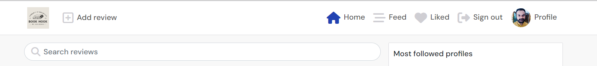    

### Home Page

The home page displays all the reviews added by various users. You can also see the navigation bar with the relevant details on the top, followed profiles on the side and the page is implemented with infinite scroll. The page content is automatically loaded as the user scrolls down.    

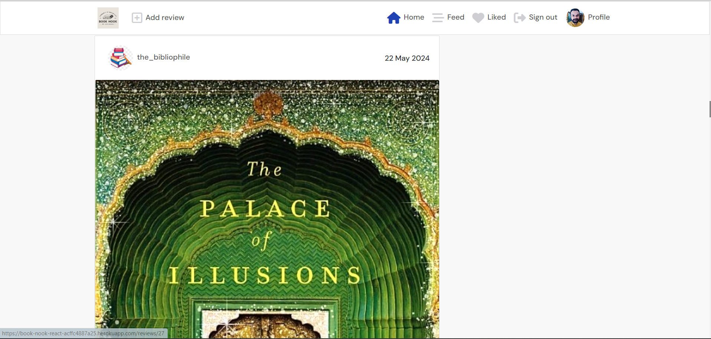    

### Profile

User profile consists of a username, password, avatar and a bio. You can add the username and password at the time of signing up. After that you can add the avatar and bio. The user profile can be updated only by the owner of the profile.
The reviews, followers and following counts are also displayed along with a user profile.

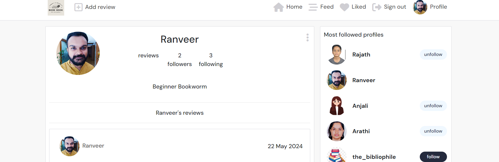    

### Review

A logged-in user can create a review. A review should have a title, contnet, ratings and an image. The added reviews are displayed on the user feed  so that other users can like and comment on them.     

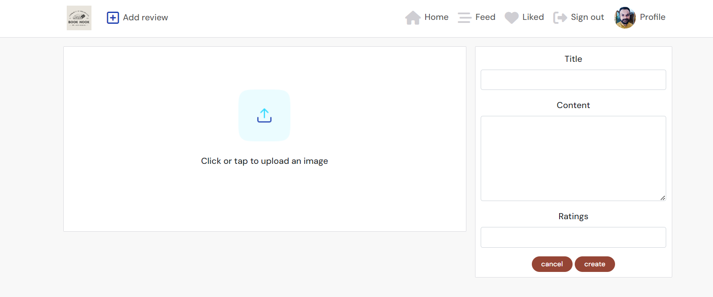

### Popular Profiles     

Popular profiles are those user profiles which are being followed by other users. The list of popular profiles is displayed on the right hand side of the home page This provides a better user experience by providing the users an option to follow the popular profiles without searching for them individually.    

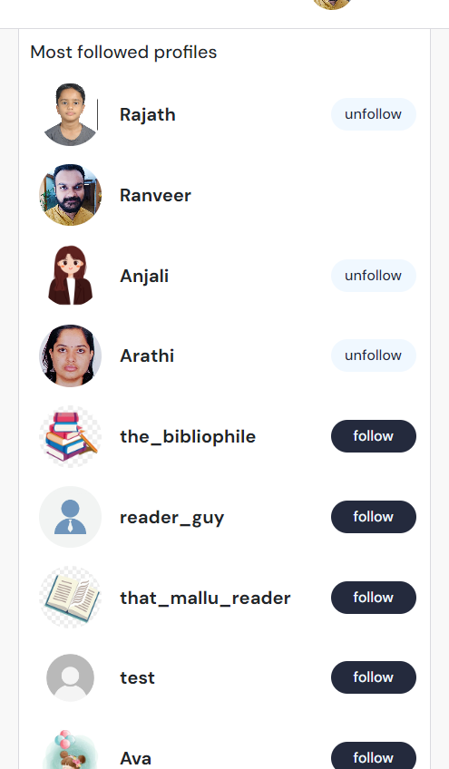   

### Comments, Likes, Followers

Comments, likes and followers are three features available in Book Nook which helps a user to interact with the other users. These features are available to logged-in users only. Once you log in, you can follow/unfollow other users. Also, you can like a review posted by another user. You can also add a comment under a review. This comment can be edited or deleted as well by the owner of the comment.

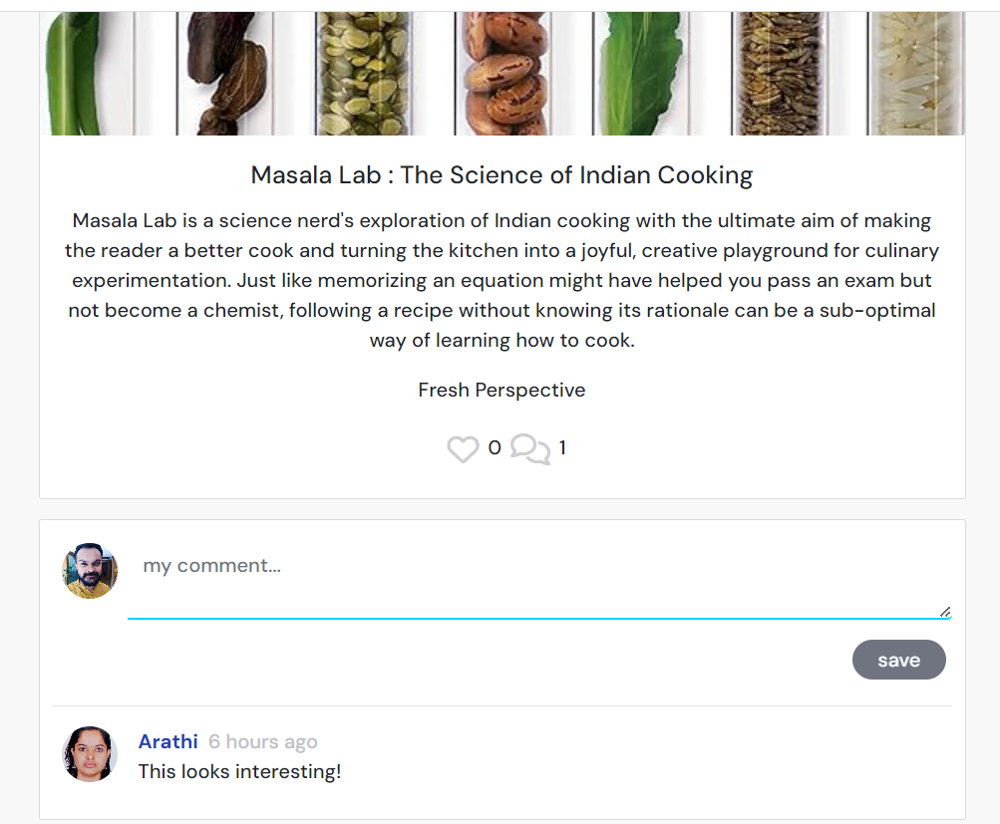     

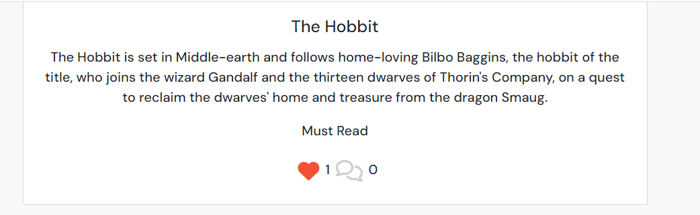     

    

### Search

Text search functionality with keywords is implemented in this application. You can search with keywords and the search results containing that particular keyword will be displayed.    

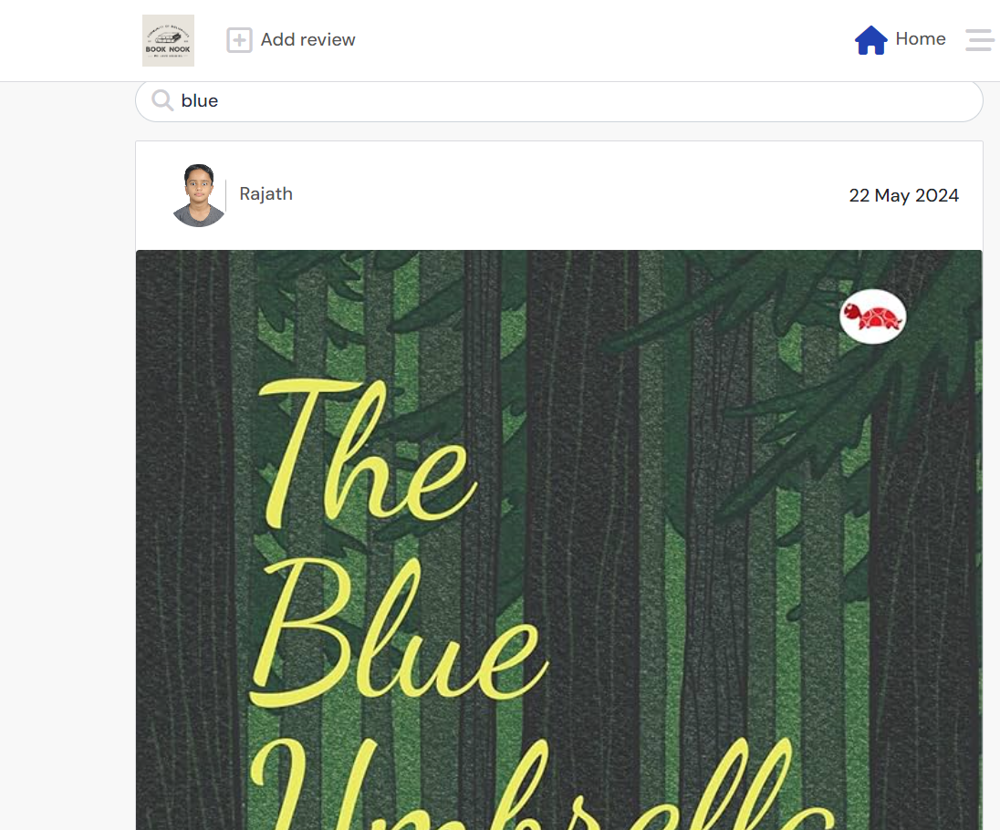

### Future Features:
- Include "My Book Shelf" feature where user can have a list of books: read, currently reading and want to read.
- Add an opton for users to add quotes either from books or own quotes.
- Provide different badges like newbie, novice, expert to user profiles based on their reviews.
- Create user groups where like minded users can discuss about their book reviews.
- Implement more features on the UI for better user experience.
- Add a recommendation score for each book on a scale of 1 to 10.

### Reusable Components:    

- MoreDropDown.js : Dropdown menu with options to edit or delete an item. It is triggered by clicking on the three dots icon
- Avatar.js : Displays user avatars
- Asset.js : A component for displaying an asset, which can be either a spinner (loading animation), an image, or a message.
- ConfirmationModal.js : A modal component for confirming actions, with options to confirm or cancel.
- NavBar.js : The navigation bar for the application, responsive and adaptive based on user authentication status.
- NotFound.js :Component to display a not found message with an image.

### Packages and Tools used
- React : JavaScript library for building dynamic and interactive user interfaces. Ideal for single-page applications.
- Axios : promise-based HTTP client for making HTTP requests, used for fetching or saving data from/to a server.
- Bootstrap & React-Bootstrap : Bootstrap provides responsive design elements and layouts. React-Bootstrap adapts these into React components for consistent styling.
- JWT-Decode : library for decoding JSON Web Tokens. Useful for interpreting the token's data on the client side.
- React Router DOM : Manages navigation in React applications, enabling dynamic routing without page reloads.
- React Infinite Scroll Component : Implements infinite scrolling, loading content as the user scrolls down, enhancing user experience.
- web-vitals : Library for measuring real user performance on your website.

# Testing     

The APIs were tested locally during development but the main testing was done using the front end app. Actual testing by communicating with the real APIs manually using form inputs and page loads.

The results can be found in: [TESTING.md](TESTING.md)

### Validator Testing

The JavaScript (React) code was validated using Eslint. Eslint was installed and configured locally.

The W3C Jigsaw CSS Validator was used to validate the CSS files and no errors were found.

### Manual Testing    

All the features were manually tested and the results were verified as expected.  The detailed test results can be found in a separate file named [TESTING.md](TESTING.md)

### Automation Testing

I have implemented mock tests for NavBar component for demonstration purpose.

### Unfixed Bugs 

There are no unfixed bugs in the application as per my knowledge. I have fixed many issues while developing like npm issues related to dependency tree, compilation errors, console errors etc.  

# Heroku Deployment    

The site is deployed to Heroku. The steps to deploy are as follows:

* Navigate to heroku and create an account

* Click the new button in the top right corner

* Select create new app

* Enter app name

* Select region and click create app

* Click the resources tab and search for Heroku Postgres

* Select hobby dev and continue

* Click the deploy tab

* Scroll down to Connect to GitHub and sign in / authorize when prompted

* In the search box, find the repositoy you want to deploy and click connect

* Scroll down to Manual deploy and choose the main branch

* Click deploy

### Version Control

The site was developed using Gitpod IDE and pushed to Github to the remote repository.

The following git commands were used throughout development to push code to the remote repo:

* git add <file> - This command was used to add the file(s) to the staging area before they are committed.

* git commit -m “commit message” - This command was used to commit changes to the local repository queue ready for the final step.

* git push - This command was used to push all committed code to the remote repository on github.

### How to Clone

Navigate to the GitHub Repository you want to clone to use locally:

* Click on the code drop down button
* Click on HTTPS
* Copy the repository link to the clipboard
* Open your IDE of choice (git must be installed for the next steps)
* Type git clone copied-git-url into the IDE terminal
* The project will now have been cloned on your local machine for use.

Install Dependencies:

- npm install

Run Application:

- npm start

### How to Fork    

Most commonly, forks are used to either propose changes to someone else's project or to use someone else's project as a starting point for your own idea.

* Navigate to the GitHub Repository you want to fork.

* On the top right of the page under the header, click the fork button.

* This will create a duplicate of the full project in your GitHub Repository.    

# Credits

### Media
- Logo created using [Canva](https://www.canva.com/)
- Favicon generated using [Favicon Generator](https://favicon.io/favicon-converter/)
- Font Awesome for icons [Font Awesome](https://fontawesome.com/)
- Wikipedia for book cover images [Wikipedia](https://www.wikipedia.org/)
- PNG Tree for user avatars [PNG Tree](https://www.wikipedia.org/)

  
### Content
- Code Institute LMS walkthrough project Moments helped me understand and implement my project better.
- My Mentor Martina for her guidance and the Slack Community for their support.